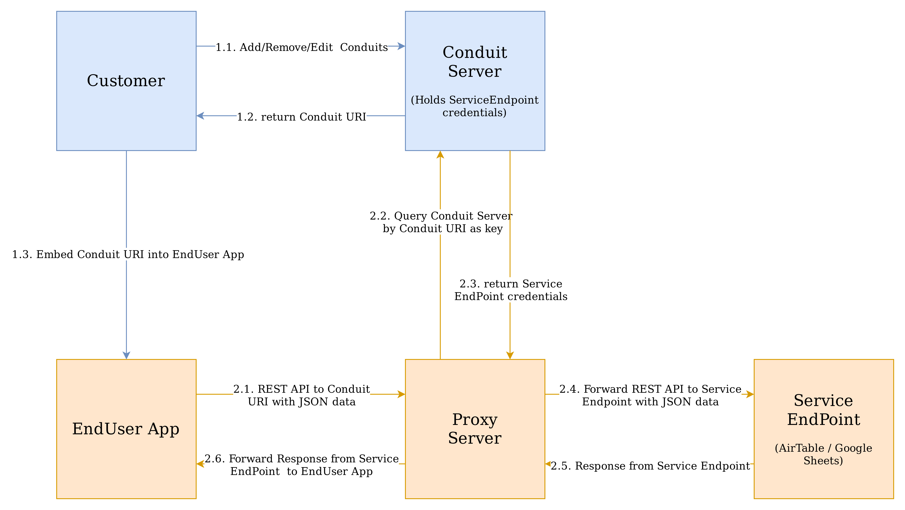

# Conduits backend services

Backend consists of a resource server and a proxy server. 

The resource server exposes a REST api to manage *users* and their 
*conduits*. A conduit is a proxy to any service that offers an api.

The proxy server provides a unified and normalized API to the *conduit*.
Requests to the *conduit* are transformed as necessary and forwarded to
the service and likewise responses. 

NOTE: technically this is a gateway; we will be gradually converting doc
and code to replace the use of the term proxy to gateway.

TBD: needs a better writeup... in the meantime this diagram provides a
good overview.




# Development

## Getting started
Two `.env` files are required to get started. Both of these files should
be present in the backend folder relative to the root of the repository.

---
> Copy `.env-example` as `.env`<br>
> Copy `.env.conduit-user.example` as `.env.conduit-user` 
---

1. A global `.env` file containing client credentials for the
   **proxy-server**
   - `PROXY_SERVER_EMAIL`
   - `PROXY_SERVER_PASSWORD`

   The above values will be used to authenticate the **_Praas user_**
   <br>
   Refer to the `.env-example` for more accurate information
   on what variables are supposed to be in the actual global
   `.env` file.
   <br>
   Notes:
   1. Create and populate this file before starting the
      **crud-server**; otherwise, it will fail to start.
   2. This is a workaround until we have proper user
      management in place.
2. A `.env.conduit-user` that contains credentials related to
   the functioning of the conduit service. This includes
   information about the external service and user details.
   This is required for testing the proxy server.
   ```code
      CONDUIT_SERVICE_TYPE=one of {airtable|googleSheets|email}
      CONDUIT_SERVICE_API_KEY=do not share your secrets
      CONDUIT_SERVICE_OBJECT_KEY=variable portion that identifies the object
   ```
3. Integration tests require bootstrap data created by unit tests. So,
   `npm run test-model` first before testing the REST api. Alternatively
   you can also run `npm run createdb`.

### Running the servers
1. Populate test data by running `test-model`
2. Start the resource server by running `start-resource-server`
3. Start the proxy server by running `start-gateway-server`

## Debugging
Error responses and stack traces can be logged to the console by setting
the `DUMP_ERROR_RESPONSE` and `DUMP_STACK_TRACE` environment variables.
The features can be enabled by prepending the environment variable with
the `npm` task command.

`DUMP_ERROR_RESPONSE=1 DUMP_STACK_TRACE=1 npm run <task-name>`

## Developer Tasks
|  task                                           | command line                        |
|:------------------------------------------------|:------------------------------------|
| Install dependencies                            |`npm install`                        |
| Run linter                                      |`npm run lint`                       |
| Fix lint errors                                 |`npm run lint:fix`                   |
| Run data layer tests                            |`npm run test-model`                 |
| Run data layer tests with code coverage         |`npm run test-model-with-coverage`   |
| Run REST api tests                              |`npm run test-rest`                  |
| Run REST api tests with code coverage           |`npm run test-rest-with-coverage`    |
| Run gateway tests                               |`npm run test-gateway`               |
| Run resource server                             |`npm run start-resource-server`      |
| Run gateway server                              |`npm run start-gateway-server`       |
| Init db with user: admin@praas.com, pwd: praas  |`npm run createdb`                   |

## Further reading
- [Data model of resource server](crud-server/README.md)
- [Testing gateway server](proxy-server/README.md)