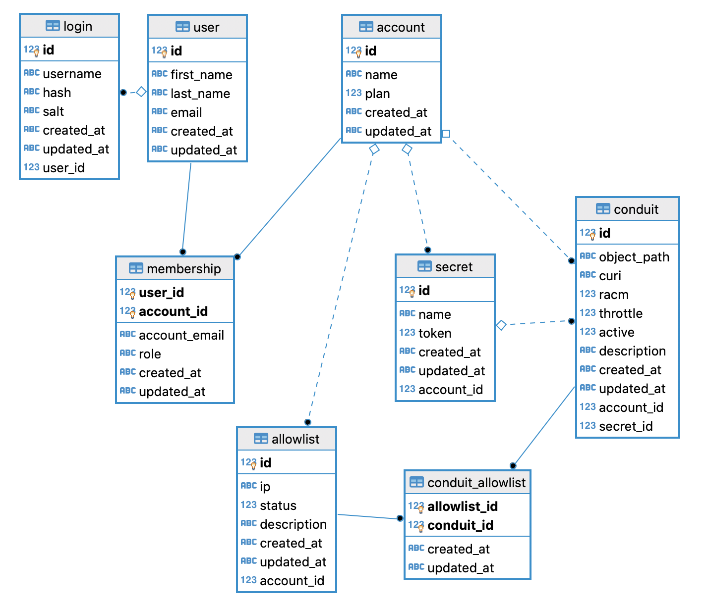

# Changes to resource server

## New database model



## Changes to API

### `/users/` API
* New endpoint `/me`
* API payload change
    ```diff
    {
    - user : {
        firstName: 'Value',
        lastName: 'Value',
        email: 'Value',
        password: ''Value'
    - }
    }
    ```
* Same above changes for the API responses

### TODO
* Conduits API
* Secrets API
* Allowlist API